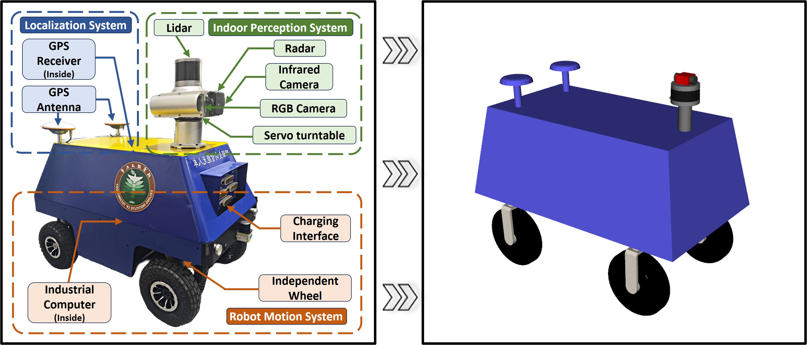
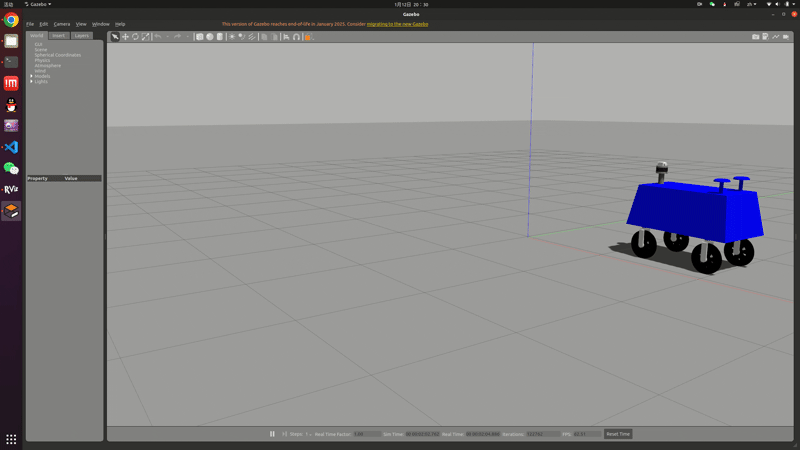

## 4WIS Robot Simulation Environment

> A comprehensive simulation environment for trajectory planning and motion control of 4WIS (Four-Wheel Independent Steering) robots<br>
> System environment: Ubuntu 20.04 + ROS Noetic

---

### Core Features

* A robot [URDF model](https://github.com/jujuebaigei123/car_4ws_4wd_urdf_models) faithfully reconstructed based on a real 4WIS physical platform
* Integration of multi-modal sensors, including a 3D LiDAR, RGB camera, IMU, and collision sensors, with
  [pointcloud_to_laserscan](https://github.com/ros-perception/pointcloud_to_laserscan/tree/1.4.1)
  for online conversion from 3D point clouds to 2D laser scan data
* Integration of map files from the [BARN dataset](https://www.cs.utexas.edu/~xiao/BARN/BARN.html) for standardized navigation benchmarking
  (Note: due to differences in robot platforms, the original trajectories and evaluation metrics cannot be directly reused)
* A control framework supporting multi-modal motion, where the input consists of discrete mode selection and continuous control commands.
  The control interface is compatible with both
  [Mixed-Integer Quadratic Programming (MIQP) Controllers](https://ieeexplore.ieee.org/document/10610461) and
  [Deep Reinforcement Learning (DRL) Controllers](https://ieeexplore.ieee.org/document/11247526/)

---

### Prerequisites

> As the environment has not yet been fully reproduced on a new machine, some dependencies may be missing. Feedback via Issues is welcome.

```bash
sudo apt install ros-noetic-gazebo-ros-pkgs
sudo apt install ros-noetic-gazebo-ros-control
sudo apt install ros-noetic-xacro 
sudo apt install ros-noetic-robot-state-publisher 
sudo apt install ros-noetic-joint-state-publisher
sudo apt install ros-noetic-image-common 
sudo apt install ros-noetic-image-transport
sudo apt install ros-noetic-cv-bridge
sudo apt install ros-noetic-urdf-geometry-parser
sudo apt install ros-noetic-four-wheel-steering-msgs
sudo apt install ros-noetic-joy
```

---

### Package Overview

* **4WIS_Robot**
  The main package of the simulation environment, including the robot model, sensor configurations, and basic launch files

  <p align="center"></p>

* **BARN**
  A navigation environment dataset used for constructing benchmark test scenarios

  <p align="center"></p>

* **four_wheel_steering_controller**
  The official ROS 4WS motion controller, which supports only a single motion mode and does not provide multi-modal switching

* **4WIS_multimodal_controller**
  A multi-modal 4WIS motion controller implemented in this project, supporting multiple steering modes and mode switching

  <p align="center"></p>

---

### Usage

```bash
# 1. Launch the basic robot platform and simulation environment (single-mode controller)
#    Sensor parameters and environment settings can be modified in the launch files
roslaunch 4WIS_Robot run_old.launch 

# 2. Launch the basic robot platform and simulation environment (multi-modal controller)
roslaunch 4WIS_Robot run_new.launch 

# 3. Directly launch the environment integrated with the BARN dataset (no need to run step 1)
#    Gamepad control supported: left joystick for forward motion, right joystick for steering,
#    RB/R1 for mode switching
runlaunch BARN_Env run.launch
```

---

### Control Interfaces and Mode Definitions

#### 1. Control Topics

* **Control command publishing**

  ```
  /robot_0/multi_mode_4ws_controller/cmd_vel
  ```

  * Type: `geometry_msgs/Twist`
  * Content: target linear velocity and equivalent steering angle

* **Mode selection publishing**

  ```
  /robot_0/multi_mode_4ws_controller/mode_select
  ```

  * Type: `std_msgs/UInt8`
  * Format: `data = mode`

* Reference implementation: `4WIS_Robot/scripts/joy_controller.py`


#### 2. Motion Mode Definitions

* **Mode 1 (mode = 0): Four-wheel Ackermann steering**
  A cooperative four-wheel Ackermann model is adopted.
  The kinematic formulation can be found in
  [*Geodesic-Based Path Planning for Port Transfer Robots on Riemannian Manifolds*](https://www.sciencedirect.com/science/article/pii/S0957417425033214)

* **Mode 2 (mode = 1): Lateral Ackermann steering**
  The underlying principle is identical to four-wheel Ackermann steering,
  except that the reference forward direction is switched from the robot front
  to the robot’s left side, enabling lateral motion

* **Mode 3 (mode = 2): Parallel motion**
  All four wheels maintain identical steering angles, enabling pure translational motion

* **Mode 4 (mode = 3): In-place rotation**
  The steering angles of all wheels are kept perpendicular to the robot center,
  such that the instantaneous center of rotation coincides with the vehicle center

#### 3. Parameter Configuration

* **All vehicle kinematic and control parameters** can be configured in
  `4WIS_Robot/config/multi_mode_4ws_controller.yaml`

* Some parameters specific to each simulation setup can be adjusted in their corresponding launch files.
  For the BARN-integrated environment, the relevant parameters are defined in
  `4WIS/launch/wo_world.launch`.
  This launch file includes all required nodes **except for loading the Gazebo world**, making it convenient to integrate with other testing environments.


---

### Discussion and Notes

* A grid offset along the Y-axis exists between the `map` and `world` files in the BARN dataset.
  This issue has been corrected in the coordinate transformation node from `world` to `map`
* Switching motion modes without the robot being fully stationary may lead to unstable behavior,
  and at high speeds may even cause rollover risks.
  For safety, it is strongly recommended to reduce the linear velocity to zero before mode switching
* Directly using wheel STL models as Gazebo collision bodies may result in discontinuous or unstable motion.
  This is likely due to poor compatibility between STL meshes and Gazebo’s collision detection.
  In this work, the issue is mitigated by manually defining simplified collision geometries

---

### Citation

If you find this simulation environment useful for your research, please consider citing the following paper:

```bibtex
@INPROCEEDINGS{11247526,
  author={Bao, Runjiao and Xu, Yongkang and Zhang, Lin and Yuan, Haoyu and Si, Jinge and Wang, Shoukun and Niu, Tianwei},
  booktitle={2025 IEEE/RSJ International Conference on Intelligent Robots and Systems (IROS)}, 
  title={Deep Reinforcement Learning-Based Trajectory Tracking Framework for 4WS Robots Considering Switch of Steering Modes}, 
  year={2025},
  pages={3792-3799},
  doi={10.1109/IROS60139.2025.11247526}
}
```


<details>
<summary>点击查看中文版</summary>


## 4WIS 机器人仿真环境

> 面向 4WIS（Four-Wheel Independent Steering）机器人轨迹规划与运动控制构建的综合仿真环境<br>
> 系统环境：Ubuntu 20.04 + ROS Noetic

---

### 基本功能

* 基于真实 4WIS 物理平台复刻的机器人 [URDF 模型]((https://github.com/jujuebaigei123/car_4ws_4wd_urdf_models))
* 集成多源传感器系统，包括 3D 激光雷达、RGB 相机、IMU 以及碰撞传感器，并融合
[pointcloud_to_laserscan](https://github.com/ros-perception/pointcloud_to_laserscan/tree/1.4.1) 实现 3D 点云到 2D 激光扫描数据的在线转换
* 集成 [BARN数据集](https://www.cs.utexas.edu/~xiao/BARN/BARN.html) 数据集中的地图文件，用于构建标准化导航测试环境
  （注：由于机器人平台差异，原始路径与评测指标无法直接复用）
* 构建支持 多模态运动的控制框架，输入包括离散的模态选择与连续的控制量，其结构符合[混合整数二次规划MIQP Controller](https://ieeexplore.ieee.org/document/10610461)与[深度强化学习DRL Controller](https://ieeexplore.ieee.org/document/11247526/)两种常用方法的需求

---

### 必要前置

> 由于尚未在新设备上进行完整环境复现，以下依赖可能存在遗漏，欢迎通过 Issue 反馈补充。

```bash
sudo apt install ros-noetic-gazebo-ros-pkgs
sudo apt install ros-noetic-gazebo-ros-control
sudo apt install ros-noetic-xacro 
sudo apt install ros-noetic-robot-state-publisher 
sudo apt install ros-noetic-joint-state-publisher
sudo apt install ros-noetic-image-common 
sudo apt install ros-noetic-image-transport
sudo apt install ros-noetic-cv-bridge
sudo apt install ros-noetic-urdf-geometry-parser
sudo apt install ros-noetic-four-wheel-steering-msgs
sudo apt install ros-noetic-joy
```

---

### 功能包说明

* **4WIS_Robot**
  仿真环境的主功能包，包含机器人模型、传感器配置及基础 launch 文件

  <p align="center"></p>

* **BARN**
  导航环境数据集，用于构建测试环境

  <p align="center"></p>

* **four_wheel_steering_controller**
  ROS 官方提供的 4WS 运动控制器，仅支持单一运动模式，不具备多模态切换能力

* **4WIS_multimodal_controller**
  本项目实现的多模态 4WIS 运动控制器，支持多种转向模式及模态切换

  <p align="center"></p>

---

### 使用说明

```bash
# 1. 启动基础机器人平台与仿真环境（单模态控制器）
#    传感器参数与环境配置可在 launch 文件中修改
roslaunch 4WIS_Robot run_old.launch 

# 2. 启动基础机器人平台与仿真环境（多模态控制器）
roslaunch 4WIS_Robot run_new.launch 

# 3. 直接启动集成 BARN 数据集的环境（无需先启动 1）
#    支持手柄控制：左摇杆前进，右摇杆转向，RB/R1切换模态
runlaunch BARN_Env run.launch
```

---

### 控制接口与模态定义

#### 1. 控制话题说明

* **控制量发布**

  ```
  /robot_0/multi_mode_4ws_controller/cmd_vel
  ```

  * 类型：`geometry_msgs/Twist`
  * 内容：目标线速度与等效转向角

* **模态选择发布**

  ```
  /robot_0/multi_mode_4ws_controller/mode_select
  ```

  * 类型：`std_msgs/UInt8`
  * 格式：`data = mode`

* 参考实现：`4WIS_Robot/scripts/joy_controller.py`

---

#### 2. 运动模态定义

* **模态 1（mode = 0）：四轮阿克曼转向**
  采用四轮协同阿克曼模型，其运动学解算可参考
  [*Geodesic-Based Path Planning for Port Transfer Robots on Riemannian Manifolds*](https://www.sciencedirect.com/science/article/pii/S0957417425033214)

* **模态 2（mode = 1）：横向阿克曼转向**
  基本原理与四轮阿克曼一致，但将参考前进方向由机器人前方
  切换为机器人左侧，实现横向行驶能力

* **模态 3（mode = 2）：平行移动**
  四个车轮转角始终保持一致，实现车体的纯平移运动

* **模态 4（mode = 3）：原地自转**
  四轮转角始终保持与机器人质心方向垂直，使瞬时转向中心位于车体中心

#### 3. 参数调整

* **车辆运动学与控制参数**全部可在4WIS_Robot/config/multi_mode_4ws_controller.yaml中调整

* 每个启动环境的部分参数可在其launch文件中调整，BARN集成环境的参数在4WIS/launch/wo_world.launch中。这个launch集成了除加载gazebo世界的其他所有节点，便于接入其他测试环境。

---

### 讨论与记录

* BARN 数据集中的 `map` 与 `world` 文件在Y 轴方向存在栅格偏移误差，已在 `world → map` 的坐标变换节点中进行修正
* 若在未完全静止状态下进行模态切换，可能导致运动不稳定，在高速情况下甚至存在侧翻风险。为保证安全性，建议在模态切换前先将线速度降至 0
* 若直接使用车轮 STL 模型作为 Gazebo 碰撞体，会出现运动不连续或不平滑的问题。推测原因是 STL 与 Gazebo 碰撞检测的兼容性较差，当前采用手动构建碰撞体积的方式进行规避

---

### 相关引用

如果本仿真环境对您的研究工作有所帮助，请引用以下论文：

```bibtex
@INPROCEEDINGS{11247526,
  author={Bao, Runjiao and Xu, Yongkang and Zhang, Lin and Yuan, Haoyu and Si, Jinge and Wang, Shoukun and Niu, Tianwei},
  booktitle={2025 IEEE/RSJ International Conference on Intelligent Robots and Systems (IROS)}, 
  title={Deep Reinforcement Learning-Based Trajectory Tracking Framework for 4WS Robots Considering Switch of Steering Modes}, 
  year={2025},
  pages={3792-3799},
  doi={10.1109/IROS60139.2025.11247526}
}
```


</details>
